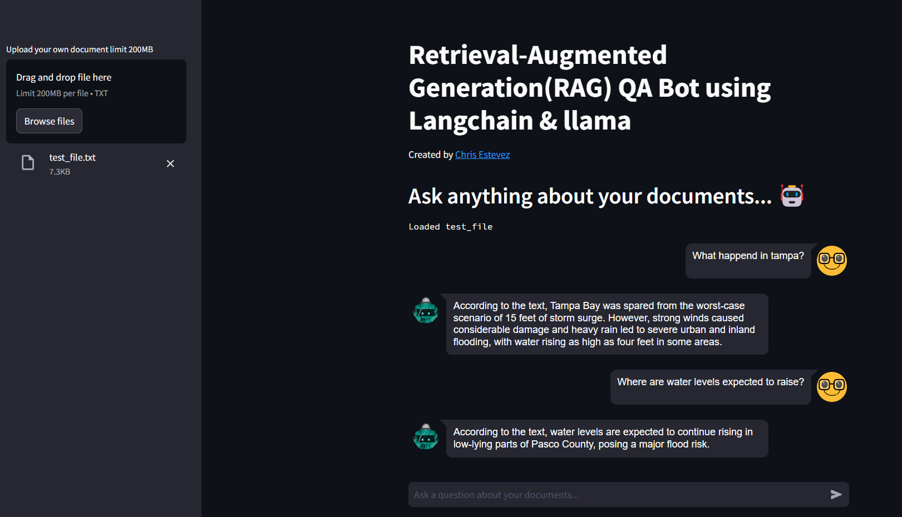
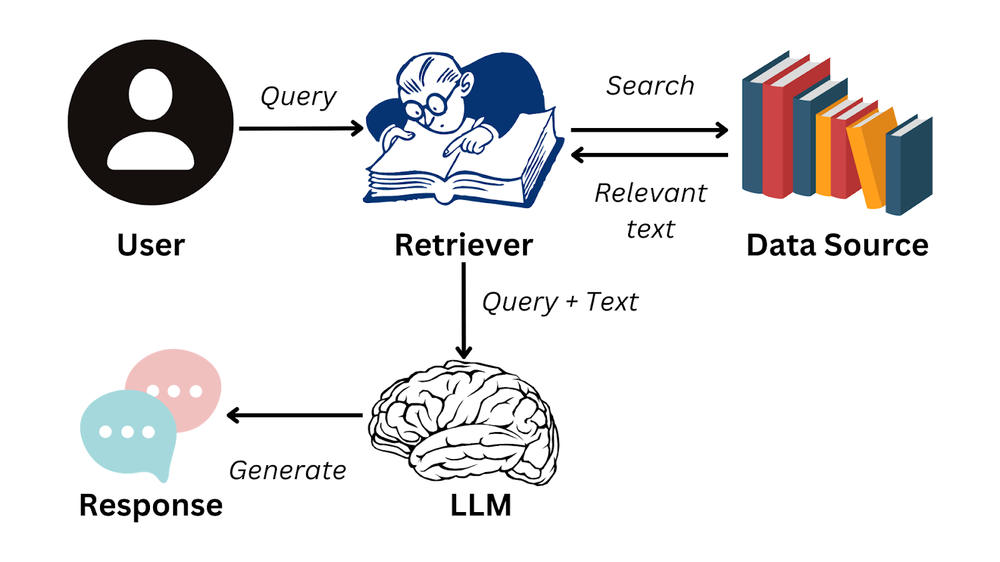

# RAG_WEB_APP

***
 
# PROJECT MOTIVATION

In this project, I applied my data science and software development skills to create a web application using Streamlit. The application allows users to interact with their documents in a conversational manner. The app processes txt formats, using techniques like document parsing and embeddings to enhance the user experience. Leveraging the ollama model, the app can understand context and provide accurate responses, making document analysis more intuitive and user-friendly. Additionally, the project can easily expand to a multi document RAG application by replacing in Memory vector base.

## LIBRARIES

    * langchain
    * ollama
    * streamlit
* Install [llama3.1](https://ollama.com/download)
* install python 3.12.6
* Install required packages with:
    * pip install -r requirements.txt

**Execution** - cmd streamlit run path_to_code/rag_app.py

# FOLDER STRUCTURE
```
- docs
| - news.txt

- lib
|- __init__.py - Initializes library
|- utils.py - Methods used in project

- imgs
|- .png - web app images

- requirements.txt - packages used in project
- README.md - project description
- rag_app.py - RAG APP
```

# WEB APP SCREENSHOTS




